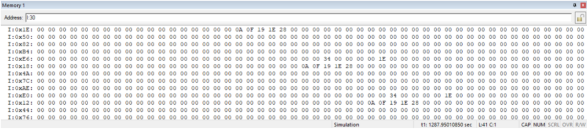
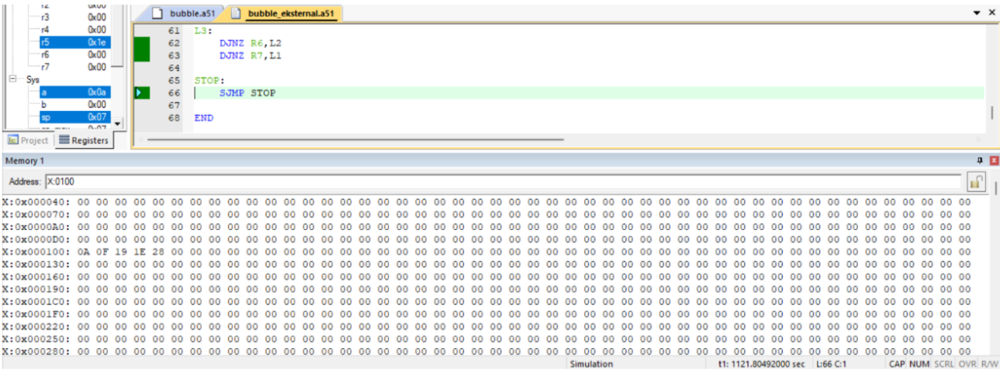
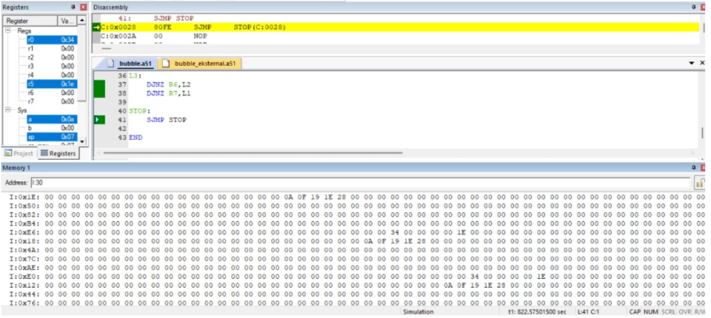

# MC8051-BUBBLE-SORT
Repositori ini mencakup bubble.a51 (implemen- tasi Internal RAM), bubble eksternal.a51 (imple- mentasi External RAM), README.md (panduan insta- lasi Keil dan reproduksi eksperimen), serta direktori /results/ berisi screenshot Memory Window dan catatan waktu simulasi ketiga konfigurasi.

# Bubble Sort pada MCS-51 (AT89C51)

## Deskripsi
Project ini berisi implementasi algoritma **Bubble Sort ascending** menggunakan bahasa Assembly MCS-51 (AT89C51). Terdapat dua versi program, yaitu menggunakan memori internal dan memori eksternal.

## File Program
- `bubble.a51` → Bubble Sort menggunakan Internal RAM.
- `bubble_eksternal.a51` → Bubble Sort menggunakan External RAM (XDATA alamat 0100H).

## Data Awal
```
25, 10, 40, 15, 30
```

Hasil pengurutan:

```
10, 15, 25, 30, 40
```

## Cara Menjalankan Program

1. Buka Keil µVision.
2. Buat project baru dan pilih device **AT89C51**.
3. Tambahkan file `bubble.a51` atau `bubble_eksternal.a51`.
4. Pada **Options for Target → Output**, centang **Create HEX File**.
5. Atur frekuensi clock pada tab **Target** (12 MHz atau 24 MHz).
6. Build project.
7. Pilih **Debug → Start/Stop Debug Session**.
8. Buka **View → Memory Window**.
9. Untuk program internal, masukkan:

```
I:30
```

10. Jalankan program dan amati perubahan data pada memori.

## Hasil Pengujian

| Konfigurasi | Waktu Simulasi |
|--------------|---------------|
| Internal RAM (24 MHz) | 1287.95010850 s |
| External RAM (24 MHz) | 1121.80492000 s |
| Internal RAM (12 MHz) | 822.57501500 s |

## Penjelasan Program

### 1. bubble.a51
Program menggunakan:
- Register R0 sebagai pointer memori internal.
- Register R7 sebagai outer loop.
- Register R6 sebagai inner loop.
- Register R5 sebagai penyimpan sementara data.
- Instruksi `SUBB` untuk membandingkan data.
- Instruksi `XCH` untuk melakukan pertukaran (swap).

### 2. bubble_eksternal.a51
Program menggunakan:
- DPTR sebagai pointer memori eksternal.
- Instruksi `MOVX` untuk akses XDATA.
- Manipulasi register DPL untuk memundurkan alamat karena MCS-51 tidak memiliki instruksi `DEC DPTR`.

## Analisis

Secara teori, akses Internal RAM lebih cepat dibandingkan External RAM. Namun hasil simulasi menunjukkan waktu eksekusi pada External RAM lebih kecil. Hal ini disebabkan oleh struktur kode pada versi eksternal yang lebih linear sehingga jumlah instruksi percabangan yang dieksekusi lebih sedikit.

Perubahan frekuensi clock dari 24 MHz menjadi 12 MHz juga menghasilkan perubahan nilai waktu simulasi pada Keil karena simulator menghitung waktu berdasarkan parameter clock yang digunakan.

## Software
- Keil µVision
- AT89C51 Simulator

## Hasil Simulasi

### Internal RAM (24 MHz)


### External RAM (24 MHz)


### Internal RAM (12 MHz)

